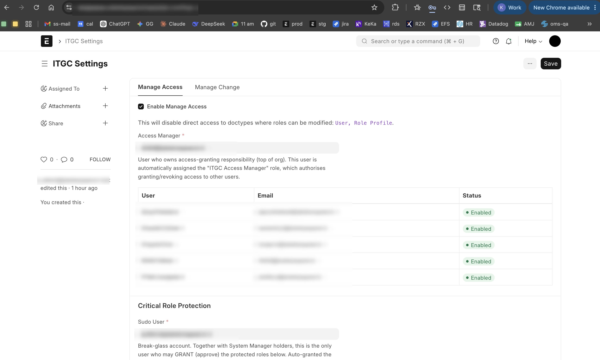
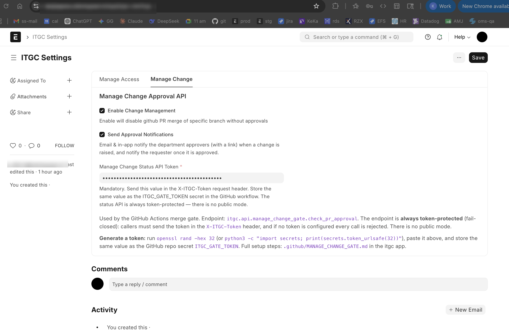
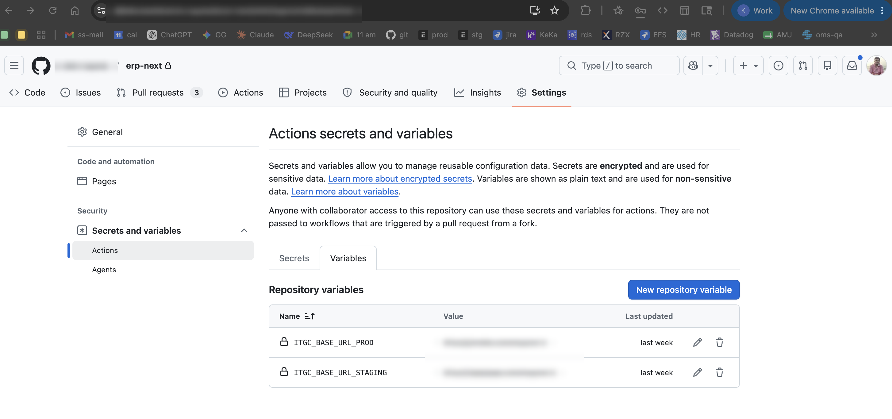
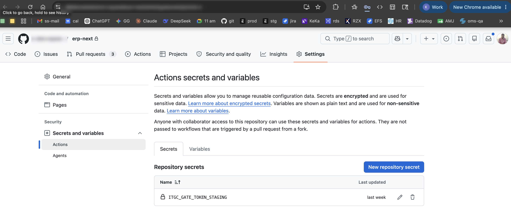

# ITGC

**Information Technology General Controls** — a Frappe app that adds two
independent governance features on top of an ERPNext/Frappe site:

| Feature | What it governs | One-line summary |
| --- | --- | --- |
| **[Manage Access](docs/MANAGE_ACCESS.md)** | *Who* can do *what* inside the ERP | A maker-checker approval flow for every access change (roles, role profiles, doctype permissions, user permissions) — plus a lockdown that disables direct edits to the underlying access masters. |
| **[Manage Change](docs/MANAGE_CHANGE.md)** | *Code* going into the ERP | An approval record for every code change + a GitHub Actions **merge gate** that blocks a PR from merging into a protected branch (`staging`, `prod`, …) until its Manage Change is approved. |

Both features are **off by default** and are switched on independently from a
single control panel: **ITGC Settings**.

> **Detailed guides:** **[Manage Access](docs/MANAGE_ACCESS.md)** ·
> **[Manage Change](docs/MANAGE_CHANGE.md)** — each with the full setup steps, the
> approval workflow, and a worked example with screenshots.

---

## The control panel — ITGC Settings

Everything is configured from one Single doctype. Open it from the Awesomebar:

> Awesomebar → type **"ITGC Settings"** → Enter

It has two tabs, one per feature:

- **Manage Access** tab → `Enable Manage Access` + access-governance config
- **Manage Change** tab → `Enable Change Management` + the merge-gate API token



---

## Quick start

1. Install the app on your site (see below).
2. Decide which feature you want and read its dedicated guide:
   - **[Manage Access setup →](docs/MANAGE_ACCESS.md)**
   - **[Manage Change setup →](docs/MANAGE_CHANGE.md)**
3. Each guide walks you through the ITGC Settings switches, the supporting master
   data (departments, approvers, branches), and a fully worked example.

---

## Installation

```bash
# From the bench directory
bench get-app itgc <repo-url>
bench --site <your-site> install-app itgc
bench --site <your-site> migrate
```

On install the app automatically (idempotent — safe to re-run):

- creates the governance **roles** — `ITGC Access Manager`, `Manage Change
  Requester`, `Manage Change Approver`;
- grants those roles the right permissions on the Manage Access / Manage Change
  doctypes;
- creates both approval **workflows** in a **disabled** state (they only turn on
  when you flip the matching switch in ITGC Settings);
- **seeds the protected-role lists** — `System Manager` as *Fully Restricted* and
  `ITGC Access Manager` as *Approval-Gated* (you can customise these later).

> Nothing changes the behaviour of your site until you tick a switch in ITGC
> Settings. Installing the app is safe and inert on its own.

---

## How the pieces fit together

```
                         ┌─────────────────────┐
                         │    ITGC Settings     │   (single control panel)
                         ├──────────┬──────────┤
              ┌──────────┤ Manage   │ Manage   ├──────────┐
              │          │ Access   │ Change   │          │
              ▼          └──────────┴──────────┘          ▼
   ┌──────────────────────┐               ┌──────────────────────────┐
   │  Manage Access flow   │               │   Manage Change flow      │
   │  • approval workflow  │               │  • approval workflow      │
   │  • access lockdown    │               │  • GitHub merge gate API  │
   └──────────────────────┘               └──────────────────────────┘
```

The two features share nothing except the settings page — you can run either one
on its own, or both together.

---

## Manage Change merge gate — setup

This is a condensed quick-reference for the merge gate; the
[Manage Change guide](docs/MANAGE_CHANGE.md) covers it in full.

These workflows block merges into the gated branches (`staging`, `prod`) until a
matching **Manage Change** record is submitted (approved) in Frappe:

| Workflow | Purpose |
| --- | --- |
| [`manage-change-check.yml`](.github/workflows/manage-change-check.yml) | On every PR to a gated branch, polls the ITGC endpoint and fails until the change is approved. |
| [`manage-change-recheck.yml`](.github/workflows/manage-change-recheck.yml) | Lets a maintainer comment `/recheck` to re-poll without pushing a new commit. |

The check calls a Frappe endpoint that is **token-protected by default**
(`itgc.api.manage_change_gate.check_pr_approval`). You configure the **same
gate token** in two places — Frappe and GitHub — so only your CI can read
approval state.

> **There is no token to fetch from a third party.** The gate token is a random
> secret *you* generate; the two sides just have to match. `GITHUB_TOKEN` (used
> by `/recheck`) is injected by Actions automatically, so no PAT is needed.

### Tokens & secrets at a glance

| Name | Type | Where | How you get it |
| --- | --- | --- | --- |
| **Gate token** | shared secret | ITGC Settings **and** GitHub secret `ITGC_GATE_TOKEN` | You generate it (Step 1). |
| `ITGC_BASE_URL` | repo **variable** | GitHub → Settings → Variables | Your Frappe site URL, e.g. `https://stagingerp.example.com` |
| `GITHUB_TOKEN` | auto | provided by Actions | Nothing to do — built in. |

### Step 1 — Generate the gate token

Create a strong random secret (either works):

```bash
openssl rand -hex 32
# or
python3 -c "import secrets; print(secrets.token_urlsafe(32))"
```

Copy the output — you'll paste the **exact same value** into Steps 2 and 3.

### Step 2 — Set the token in Frappe

1. Open **ITGC Settings** (Awesomebar → "ITGC Settings") → **Manage Change** tab.
2. Tick **Enable Change Management**.
3. Paste the value into **"Manage Change Status API Token"** and **Save**. This
   token is **mandatory** — the status endpoint is always token-protected
   (fail-closed) and has **no public mode**.



> The endpoint requires a matching `X-ITGC-Token` header on every call. If no
> token is configured, or the header is missing or wrong, the call is rejected
> with `401` — approval state is never exposed without the token.

### Step 3 — Add the secret + variable in GitHub

Repo → **Settings → Secrets and variables → Actions**.

**Variables** tab → *New repository variable*
- Name: `ITGC_BASE_URL`
- Value: your Frappe site URL (no trailing path), e.g. `https://stagingerp.example.com`



**Secrets** tab → *New repository secret*
- Name: `ITGC_GATE_TOKEN`
- Value: the same string from Step 1



The check workflow sends `ITGC_GATE_TOKEN` as the `X-ITGC-Token` header and the
endpoint accepts it.

### Step 4 — Make the check required (branch protection)

So PRs can't merge while the check is red:

**Settings → Branches → Add rule** for `staging` and `prod` → *Require status
checks to pass before merging* → select **"Check Manage Change is approved"**.


### Rotating the token

1. Generate a new value (Step 1).
2. Update **both** the GitHub secret `ITGC_GATE_TOKEN` and the ITGC Settings
   token field. They must change together or the gate returns `401`.

### Troubleshooting

| PR comment reason | Meaning | Fix |
| --- | --- | --- |
| `unauthorized` | Token missing/mismatched, or none configured. | Re-check Steps 2 & 3 match exactly. |
| `no_manage_change_record` | No submitted Manage Change for this PR URL + branch. | Set `version_control_url` on the approved Manage Change to the PR URL. |
| `not_approved` | Record exists but isn't approved (`docstatus != 1`). | Get it approved. |
| `missing_parameters` | Workflow didn't send `pr_url`/`target_branch`. | Check the workflow config / `ITGC_BASE_URL`. |

A condensed copy of this guide also lives at
[.github/MANAGE_CHANGE_GATE.md](.github/MANAGE_CHANGE_GATE.md).

---

#### License

mit
