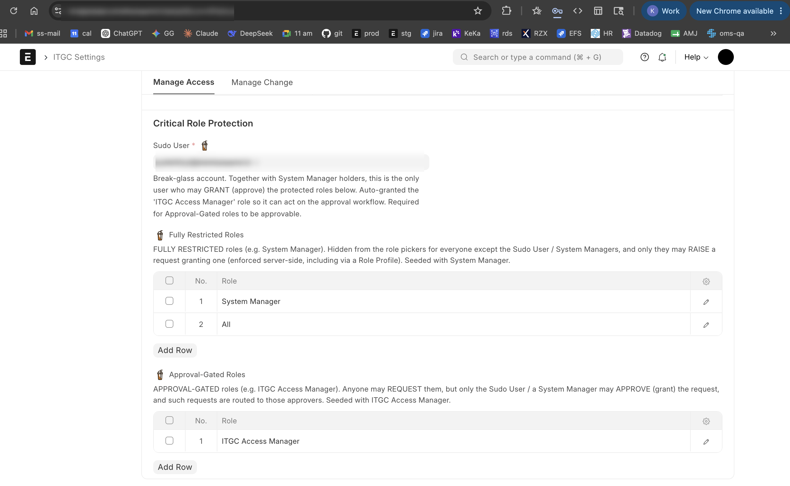

# Manage Access — Access Governance

> Maker-checker approval for **every** access change in the ERP, plus a lockdown
> that disables the back doors. Once enabled, the only sanctioned way to change a
> user's roles, role profile, doctype permissions or user permissions is to raise
> a **Manage Access** request and have it approved.

- [What it does](#what-it-does)
- [Core concepts](#core-concepts)
- [Setup — step by step](#setup--step-by-step)
- [Request types reference](#request-types-reference)
- [The approval workflow](#the-approval-workflow)
- [Worked example](#worked-example)
- [Break-glass & troubleshooting](#break-glass--troubleshooting)

---

## What it does

When **Manage Access** is enabled, two things switch on together from a single
flag:

1. **An approval workflow.** Every Manage Access request goes `Pending → Approved`
   (or `Rejected`). The change is only applied to the system when an authorised
   approver approves it.
2. **A lockdown ("access-master guard").** Direct, human edits to the underlying
   access masters are **blocked** from the UI:
   - a **User**'s roles / role profile (and deleting a User),
   - **Role** and **Role Profile** records,
   - **Custom DocPerm** and a doctype's **Permissions** table,
   - **User Permission** records,
   - bulk writes via **Data Import**.

   The block message tells the user to raise a Manage Access request instead.

   The lockdown deliberately does **not** fire for the Manage Access apply path
   itself, for install / migrate / patches / setup wizard, for background jobs and
   schedulers, or for the server shell (`bench console`) — that last one is your
   intentional **break-glass** path.

<!-- IMAGE: ma-lockdown-blocked.png
     Screenshot of the "Blocked — ITGC Manage Access" error a user sees when trying
     to edit a User's roles directly with Manage Access enabled. -->


---

## Core concepts

### Roles

| Role | Meaning | Who gets it |
| --- | --- | --- |
| **ITGC Access Manager** | The access-granting role. Its holders can approve access requests and may raise admin actions (revoke / disable) for other users. | Auto-assigned to the **Access Manager** and the **Sudo User** chosen in ITGC Settings. Can also be granted per-department. |
| **System Manager** | Frappe's super-admin. Sees every request, can raise every request type, and is one of the two parties that may grant protected roles. | Existing site admins. |
| **All** | Held by every user. Lets anyone *raise* a request (but not approve one). | Everyone. |

### Sudo User (break-glass)

A single, enabled user designated as the break-glass approver. Together with
System Managers, the Sudo User is the **only** party allowed to **grant
(approve)** a protected role. ITGC Settings will not let you enable Manage Access
without a valid, enabled Sudo User — otherwise a protected-role request could be
raised but never approved.

### Protected roles — two tiers

Configured as two tables in ITGC Settings:

| Tier | Field | Behaviour | Seeded with |
| --- | --- | --- | --- |
| **Fully Restricted** | `Fully Restricted Roles` | **Hidden** from the role pickers for everyone except Sudo User / System Managers, and only they may even *raise* a request that grants one (also enforced if pulled in via a Role Profile). | `System Manager` |
| **Approval-Gated** | `Approval-Gated Roles` | **Visible** — anyone may *request* it — but only the Sudo User / a System Manager may *approve* (grant) it, and such requests are routed to those approvers. | `ITGC Access Manager` |

Both tiers also get a **lockout guard**: a revoke/disable can never remove the
*last active holder* of a protected role (so you can't lock everyone out of
System Manager).

### Departments & approver routing

A request is routed for approval based on the **Department** the requester picks:

- **Manage Access Department** holds a list of **Access Managers** (its approvers).
- When a request is saved, its read-only **Approvers** table is populated from the
  chosen department's Access Managers.
- **Separation of duties:** self-approval is off. If the requester is the only
  approver in the department (or no department applies), the **global Access
  Manager** from ITGC Settings is added as a fallback so a request is never stuck.
- **Protected-role grants override routing:** they always go to the authorised
  approvers (Sudo User / System Managers holding the Access Manager role), not the
  department's Access Managers.

---

## Setup — step by step

### Step 1 — Create the supporting masters

Before enabling the feature, prepare the data it routes on.

**1a. Users that will approve.** Make sure the people who will approve requests
exist as enabled Users.

**1b. Manage Access Department(s).** Create one per approval group.

> New → **Manage Access Department**
> - **Department Name** — e.g. `Finance`, `Operations`, `IT`
> - **Access Managers** — the users who approve requests for this department

<!-- IMAGE: ma-department.png
     Screenshot of a new Manage Access Department record with Department Name filled
     and one or two Access Managers added to the Access Managers table. -->


### Step 2 — Configure ITGC Settings (Manage Access tab)

> Awesomebar → **ITGC Settings** → **Manage Access** tab

Fill in, in order:

1. **Access Manager** *(mandatory)* — the user who owns access-granting
   responsibility (top of the org). Auto-granted the `ITGC Access Manager` role.
   Also acts as the global fallback approver.
2. **Sudo User** *(mandatory, must be enabled)* — the break-glass approver for
   protected-role grants. Auto-granted the `ITGC Access Manager` role.
3. **Fully Restricted Roles** — pre-seeded with `System Manager`; add any other
   roles only Sudo/SM may request.
4. **Approval-Gated Roles** — pre-seeded with `ITGC Access Manager`; add any role
   anyone may request but only Sudo/SM may grant.
5. **Access Manager Role Holders** — read-only live list; confirms who currently
   holds the `ITGC Access Manager` role.

<!-- IMAGE: ma-settings-1.png — top of ITGC Settings -> Manage Access tab: Enable Manage Access,
     Access Manager, and the Access Manager Role Holders table. -->


<!-- IMAGE: ma-settings-2.png — lower part of the same tab: Sudo User and the two
     protected-role tables (Fully Restricted / Approval-Gated). -->


### Step 3 — Enable

Tick **Enable Manage Access** and **Save**.

This single switch:
- activates the `ITGC Manage Access Approval` workflow, and
- turns on the access-master lockdown described above.

<!-- IMAGE: ma-enable-toggle.png
     Close-up of the "Enable Manage Access" checkbox ticked, with the inline note about
     disabling direct access to User / Role Profile visible. -->


> **Validation guard:** saving with Manage Access enabled but no valid/enabled
> Sudo User is blocked with a clear error. This is intentional — it prevents a
> state where protected-role requests can be raised but never approved.

### Step 4 — Verify

- Try to edit a User's roles directly → you should get the **"Blocked — ITGC
  Manage Access"** message.
- Open **Manage Access** (New) as a normal user → you should be able to raise a
  request but not approve it.

---

## Request types reference

The **Request Type** field drives the whole form — fields show/hide based on it.

| Request Type | Acts on | Who may raise | What approval applies |
| --- | --- | --- | --- |
| **New User** | A not-yet-onboarded user (no role profile) | Anyone | Assigns a Role and/or Role Profile |
| **Request Role** | The requester (default) or chosen user | Anyone | Adds a Role |
| **Request Role Profile** | The requester or chosen user | Anyone | Sets a Role Profile |
| **Request User Permission** | The requester or chosen user | Anyone | Creates User Permission rows (value-level access) |
| **Revoke Role** | Another user | ITGC Access Manager / SM / Sudo | Removes a Role |
| **Revoke Role Profile** | Another user | ITGC Access Manager / SM / Sudo | Clears the Role Profile |
| **Revoke User Permission** | Another user | ITGC Access Manager / SM / Sudo | Deletes matching User Permission rows |
| **Disable User** | Another user | ITGC Access Manager / SM / Sudo | Disables the user account |
| **Change Doctype Permission** | A doctype's Custom DocPerm | **System Manager only** | Sets read/write/create/… for a role at a permission level |
| **Create Role Profile** | A new Role Profile | **System Manager only** | Creates the Role Profile with the listed roles |
| **Modify Role Profile** | An existing Role Profile | **System Manager only** | Replaces its roles; re-syncs all assigned users |

Notes:
- Non-admins simply don't see the request types they aren't allowed to raise; the
  server re-enforces every rule (so the REST API is covered too, not just the form).
- For **New User**, the "For User" picker lists users with **no Role Profile yet**
  (regardless of user type — fresh self-signups land as Website Users).
- For **Change Doctype Permission** and **Modify Role Profile**, the form
  pre-fills the *current* permissions / roles so you edit from the real state and
  never silently wipe something. A **before-change snapshot** is stored on the
  record for the audit trail.

<!-- IMAGE: ma-request-types.png
     Screenshot of the Manage Access form's Request Type dropdown expanded, showing the
     full list of request types. -->


---

## The approval workflow

`ITGC Manage Access Approval` drives the record through three states:

```
            ┌──────────┐  Approve (approver)   ┌──────────┐
            │ Pending  │ ────────────────────▶ │ Approved │  (docstatus 1 → applied)
   raise ──▶│          │                        └──────────┘
            │          │  Reject (approver)     ┌──────────┐
            │          │ ────────────────────▶ │ Rejected │
            └──────────┘                        └────┬─────┘
                  ▲          Resubmit (requester)    │
                  └──────────────────────────────────┘
```

- **Approve** / **Reject** can only be done by a user listed in the request's
  **Approvers** table (capability = `ITGC Access Manager` role; identity = the
  approver list). **Self-approval is off.**
- **Approve** submits the record (`docstatus 1`), which triggers **apply** — the
  actual change is written to the system at that moment.
- **Reject** keeps it editable; only the **requester** may fix and **Resubmit**.
- **Maker-checker:** an approver may read the request and act on the workflow, but
  **cannot edit its content** — only the requester (or a System Manager) can.
- **Visibility:** a requester sees their own requests; an approver sees requests
  routed to them; a System Manager sees everything.

<!-- IMAGE: ma-workflow-actions.png
     Screenshot of a submitted-for-approval Manage Access record showing the workflow
     action buttons (Approve / Reject) in the top-right. -->


---

## Worked example

**Scenario:** *Priya* (a team lead in the **Operations** department) needs the
**Stock Manager** role. *Rahul* is the Operations department's Access Manager.

### 1. Prerequisite (one-time, admin)

A `Operations` **Manage Access Department** exists with **Rahul** in its Access
Managers. (See [Step 1](#step-1--create-the-supporting-masters).)

### 2. Priya raises the request

> New → **Manage Access**
> - **Request Type:** `Request Role`
> - **For User:** `priya@example.com` (defaults to herself)
> - **Role:** `Stock Manager`
> - **Department:** `Operations`
> - **Save**

On save, the **Approvers** table auto-fills with **Rahul**. The workflow state is
**Pending**.

<!-- IMAGE: ma-example-request.png
     Screenshot of Priya's "Request Role" record: Request Type = Request Role,
     For User = priya, Role = Stock Manager, Department = Operations, Approvers showing Rahul,
     workflow state = Pending. -->


### 3. Rahul approves

Rahul opens the request (it appears in his list because he's an approver), reviews
it, and clicks **Approve**.

<!-- IMAGE: ma-example-approve.png
     Screenshot of Rahul's view of the same record with the Approve button highlighted. -->


### 4. The change is applied

On approval the record is submitted and **apply** runs: `Stock Manager` is added
to Priya's User record automatically. The workflow state is now **Approved** and
the record is read-only (audit trail).

<!-- IMAGE: ma-example-applied.png
     Screenshot of Priya's User record (or the approved Manage Access record) showing
     the Stock Manager role now granted / workflow state Approved. -->


> Had Rahul tried to *edit* the role from Request Role to System Manager before
> approving, the maker-checker guard would have refused — only Priya can change
> her own request's content.

---

## Self sign-up domain restriction

An independent control (separate from the **Enable Manage Access** lockdown) that
restricts **public self sign-up** to an allow-list of email domains.

- **ITGC Settings → Manage Access tab → Self Sign-Up Domain Restriction**
  - **Restrict Self Sign-Up to Allowed Domains** (check) — turns the control on.
  - **Allowed Sign-Up Domains** (table) — one domain per row, **without** the `@`
    (e.g. `solarsquare.in`). Sub-domains (e.g. `mail.solarsquare.in`) must be listed
    explicitly; matching is exact and case-insensitive.

**Scope — only public self sign-up.** The control gates account creation done while
logged out (the `Guest`-context `sign_up` / social-login path). Admin-created users
and the governed Manage Access **New User** flow run as a logged-in, authorised user
and are **never** gated — those paths are already controlled and audited.

**Fail-secure.** If the control is ON but the domain list is empty, **every** self
sign-up is blocked (an enabled control is never a silent no-op).

> Audit note: this is a *compensating* hardening, not the primary access control.
> The audit-grade control for provisioning remains authorized creation via the
> **New User** request (maker-checker). Use a corporate domain only — listing a
> public provider (e.g. `gmail.com`) defeats the purpose.

---

## Break-glass & troubleshooting

| Situation | What to do |
| --- | --- |
| **Locked out / workflow stuck** | The lockdown does **not** apply in `bench console`. Run `bench --site <site> console` and make the change directly with `ignore_permissions`. This is the intended break-glass path (no HTTP request = no guard). |
| **Can't enable Manage Access** | "Set a Sudo User…" → pick a valid, **enabled** user as Sudo User first. |
| **Protected-role request has no approver** | The message asks you to set a **Sudo User** in ITGC Settings. Do so; it auto-gets the `ITGC Access Manager` role and becomes the approver. |
| **Approver can't see a request** | Confirm they're in the request's **Approvers** table (i.e. an Access Manager of the chosen Department), or that the global Access Manager fallback applied. |
| **A granted role keeps disappearing** | Frappe's Role Profile sync strips ad-hoc roles on User save; the app re-asserts the `ITGC Access Manager` grant automatically. For other roles, grant them through Manage Access (or include them in a Role Profile). |
| **"Revoke Role" won't remove a role / role comes back** | The role is supplied by the user's **Role Profile**, so a per-user revoke can't remove it (core re-applies every profile role on save). The request is now refused with this guidance. To actually remove it: **Revoke Role Profile** (drop the whole profile from this user) or **Modify Role Profile** (drop the role from the profile for everyone on it). |
| **Turning the feature off** | Untick **Enable Manage Access** and Save. The workflow deactivates and the lockdown lifts; existing records stay for audit. |

---

See also: **[Manage Change →](MANAGE_CHANGE.md)** · **[Overview / README →](../README.md)**
